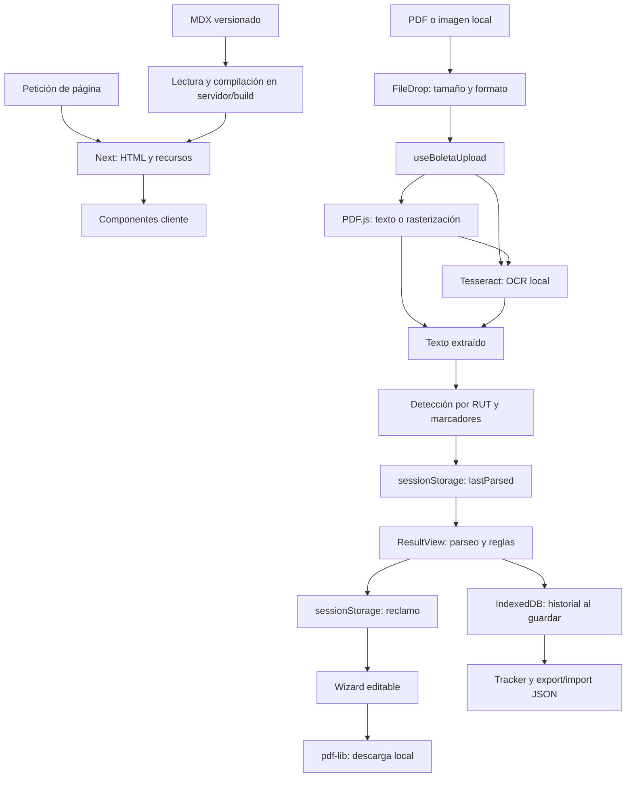

# Auditoría técnica, arquitectura y experiencia de usuario de lalupa.cl

> Seguimiento del 25 de septiembre: ver [Mejoras implementadas](MEJORAS_IMPLEMENTADAS_2026-09-25.md). Esta auditoría conserva el diagnóstico previo; algunos hallazgos ya tienen correcciones locales verificadas.

**Fecha:** 24 de septiembre de 2026. **Base:** commit `7976a8d`, sin cambios locales al iniciar. **Alcance:** repositorio, dependencias instaladas y aplicación compilada ejecutada localmente. No se modificó código funcional ni se desplegaron cambios.

## Diagnóstico ejecutivo

El proyecto tiene una arquitectura apropiada para su propósito: contenido editorial prerenderizado y herramientas que procesan documentos y conservan datos en el navegador. TypeScript estricto, parsers por proveedor, componentes compartidos, validación de importaciones y una suite de 705 pruebas constituyen una base útil. No hay una razón técnica observada para introducir microservicios, cuentas de usuario o una base remota. Evidencia: `tsconfig.json`, `src/lib/parsers/`, `src/lib/storage/historial.ts`, `src/lib/guias.ts`.

**El principal riesgo es emitir conclusiones más firmes que la evidencia extraída.** La extracción PDF elimina la estructura que necesita el parser sanitario; una lectura incompleta puede acompañarse de un mensaje tranquilizador; se comparan cargos con referencias sin resolver fecha y zona; y el borrador de reclamo inventa una gestión previa del usuario. A esto se agregan fallos de identidad y portabilidad del historial y una configuración de Clarity que no hace lo que sus comentarios prometen. Véanse C01–C09 y S01.

La recomendación es conservar la arquitectura local y dedicar la primera etapa a **exactitud, privacidad, integridad del historial y verificación efectiva**. La optimización de hosting es secundaria, pero concreta: el build revela seis patrones de rutas dinámicas y CI repite tres builds de producción. Evidencia: `src/app/boleta-luz/[empresa]/page.tsx`, equivalentes de agua/gas, `src/app/api/`, `src/app/guias/rss.xml/route.ts`, `.github/workflows/ci.yml`.

### Método, resultados y límites

Se inventariaron 248 archivos versionados, 218 bajo `src/`, 16 guías MDX, 19 archivos `page.tsx`, tres Route Handlers, 38 archivos de tests unitarios y siete archivos E2E. Se revisaron configuración raíz, entradas, parsers, persistencia, formularios, reglas de negocio, contenido, seguridad, diseño y automatizaciones. Se consultó la documentación incluida en `node_modules/next/dist/docs/`, especialmente exportación estática y CSP.

| Verificación ejecutada | Resultado observado |
| --- | --- |
| `pnpm lint` | Aprobada. |
| `pnpm lint:tono` | Aprobada; 150 archivos revisados. |
| `NEXT_TELEMETRY_DISABLED=1 pnpm build` | Aprobada, incluido TypeScript. El primer intento falló por acceso de red a Google Fonts; con acceso a red compiló. |
| `pnpm test:coverage` | **705 tests aprobados en 38 archivos; comando fallido por cobertura.** Líneas 79,82% / mínimo 80%; sentencias 78,99% / 80%; ramas 70,87% / 75%; funciones 83,13% / 80%. |
| `pnpm test:e2e --workers=2` | **88 aprobados, uno fallido**, en Chromium, 26,6 s. Fallo de selector del test HEIC, no ausencia del mensaje. |
| `pnpm check:bundle-size` | Aprobada: 35 chunks, 2.658 KiB totales, mayor chunk 432 KiB; límites 3.500/600. |
| `node scripts/perf-audit.mjs http://localhost:3100 --assert` | Aprobada en cuatro rutas locales. Resultados y limitaciones en Fase 3. |
| `pnpm audit --json` | Registro reporta **47 incidencias**: 2 críticas, 28 altas, 16 moderadas y una baja. No equivalen a 47 vulnerabilidades explotables. |
| `pnpm audit --prod --json` | **29 incidencias**: 2 críticas, 17 altas, 9 moderadas y una baja. El grafo de producción incluye dependencias que pueden usarse solo al compilar. |
| Axe sin excluir contraste, 14 rutas | Contraste insuficiente confirmado en comparador. La captura de subsidio incluye resultados durante una transición de opacidad; no se consideran defectos persistentes confirmados. |
| Layout a 390 × 844 | Sin desbordamiento horizontal de documento en las 14 rutas iniciales comprobadas. No cubre todos los estados poblados. |
| Pruebas adicionales con datos sintéticos | Confirmados: fechas normalizadas indebidamente, colisión de identidad, incompatibilidad export/import, fallo de Otsu, pérdida de cargos al aplanar texto, fallos por storage bloqueado y ausencia de `Promise.withResolvers`. |

Evidencias persistidas en `docs/auditoria/2026-09-24/`: `verificacion.txt`, `reproducciones.txt`, `navegador.json`, `dependencias.json`, `licencias.json` y `complejidad.json`. Las reproducciones de funciones cargaron el TypeScript real mediante `transpileModule`; para inspeccionar identidad y schema se expusieron dos símbolos privados únicamente en memoria. No se parcheó la aplicación.

**Límites:** no se inspeccionaron paneles de Vercel/Clarity, tráfico real, facturación, permisos de GitHub, protección de ramas ni dispositivos iOS físicos. No se ejecutaron exploits contra producción, pruebas de carga destructivas ni una validación jurídica de cada norma o tarifa. Una fecha de revisión vencida prueba falta de mantenimiento documentado; no prueba por sí sola que cada precio sea incorrecto. No se midieron Core Web Vitals de usuarios reales.

Prioridades utilizadas: **P1**, corregir antes de ampliar uso o promover el servicio como verificación confiable; **P2**, siguiente iteración; **P3**, mejora secundaria. No se declara un P0 de explotación remota comprobada.

## Fase 1: Reconocimiento, Estructura e Infraestructura

### 1. Stack y Dependencias

#### Runtime y versiones efectivas

Las versiones siguientes se verificaron en `package.json`, `pnpm-lock.yaml` y los manifiestos instalados; no se infirieron de los rangos semánticos.

| Capa | Implementación/versiones instaladas | Responsabilidad y evidencia |
| --- | --- | --- |
| Runtime | Node local **22.22.1**; CI Node **22**; pnpm local **10.33.4**, CI **10** | Desarrollo/build/servidor Next. `.github/workflows/ci.yml`, `package.json`. |
| Framework | **Next 16.2.5**, App Router, RSC, Turbopack | Rutas, prerender, metadata y endpoints. `src/app/layout.tsx`, `next.config.ts`. |
| UI | **React / React DOM 19.2.4** | Islas interactivas y herramientas. `package.json`, componentes con `'use client'`. |
| Lenguaje | **TypeScript 5.9.3**, `strict: true` | Tipado; `skipLibCheck: true`, `allowJs: true`. `tsconfig.json`. |
| Estilos | **Tailwind 4.2.4**, `@tailwindcss/postcss` 4.2.4 | Tokens y utilidades. `src/app/globals.css`, `postcss.config.mjs`. |
| Componentes | Radix Slot **1.2.4**, CVA **0.7.1**, clsx **2.1.1**, tailwind-merge **3.5.0**, lucide-react **1.14.0** | Composición, variantes, clases e iconos. `src/components/ui/Button.tsx`, `src/lib/utils.ts`. |
| Extracción PDF | **pdfjs-dist 5.7.284** | Texto y rasterización; importación diferida. `src/lib/parsers/engine.ts`. |
| OCR | **tesseract.js 7.0.0**, worker/WASM/modelo español locales | Reconocimiento en Web Worker. `src/lib/parsers/ocr.ts`, `scripts/setup-tesseract.mjs`. |
| Persistencia | **idb 8.0.3**, IndexedDB | Histórico local; no ORM ni DB remota. `src/lib/storage/historial.ts`. |
| Validación | **Zod 4.4.3** | Importación y reclamo; cobertura desigual de otros límites. `src/lib/storage/historial.ts`, wizard SERNAC. |
| Documentos | **pdf-lib 1.17.1** | Generación local de carta PDF. `src/lib/sernac/letter.ts`. |
| Editorial | next-mdx-remote **6.0.0**, gray-matter **4.0.3**, remark-gfm **4.0.1**, rehype-slug **6.0.0**, github-slugger **2.0.0** | Compilación MDX, frontmatter y TOC. `src/lib/guias.ts`, `src/app/guias/[slug]/page.tsx`, `src/lib/guias-utils.ts`. |
| Fechas | **date-fns 4.1.0** | Formatos en español. `src/lib/sernac/letter.ts`, `src/components/parsers/ResultBlock.tsx`. |
| Calidad | Vitest/coverage/UI **4.1.5**, Playwright **1.59.1**, axe-playwright **4.11.3**, ESLint **9.39.4**, prettier **3.8.3** | Tests, accesibilidad y lint. Configuraciones raíz. |

**Contrato de runtime incompleto — P2.** `package.json` no declara `engines` ni `packageManager`, y no hay archivo versionado `.nvmrc`/`.node-version`. PDF.js declara Node `>=22.13.0 || >=24`; el mínimo de Next, `>=20.9.0`, no basta para todo el grafo. Los tipos de Node siguen en `20.19.39` frente a Node 22 en CI. Fijar versiones compatibles y documentar el mínimo real. Evidencia adicional: `docs/auditoria/2026-09-24/dependencias.json`.

#### Actualizaciones, duplicación y redundancia

La consulta al registro detectó **23 dependencias directas desactualizadas**, sin marcar esas entradas como deprecadas. Ejemplos al día de la auditoría:

| Paquete | Instalado | Última versión reportada | Tratamiento recomendado |
| --- | --- | --- | --- |
| next / eslint-config-next | 16.2.5 | 16.3.6 | Actualizar juntos, revisar advisories y probar render/caching. |
| pdfjs-dist | 5.7.284 | 6.3.289 | Upgrade mayor controlado; coordinar API, worker y compatibilidad. |
| react / react-dom | 19.2.4 | 19.3.0 | Actualizar en conjunto, con Next compatible. |
| Tailwind / plugin PostCSS | 4.2.4 | 4.3.3 | Actualización coordinada y regresión visual. |
| Playwright | 1.59.1 | 1.63.0 | Reinstalar navegadores correspondientes. |
| Vitest y paquetes asociados | 4.1.5 | 5.0.1 | No mezclar versiones; evaluar primero parches de seguridad de la rama compatible. |
| TypeScript | 5.9.3 | 7.0.2 | Cambio mayor independiente de la corrección urgente de producto. |
| Zod | 4.4.3 | 4.6.5 | Verificar comportamiento de schemas y CSP. |

El inventario completo, incluyendo versiones restantes y avisos, está en `docs/auditoria/2026-09-24/dependencias.json`. La publicación oficial consultada de Next confirma [16.3.6](https://github.com/vercel/next.js/releases/tag/v16.3.6).

`pnpm-lock.yaml` contiene duplicados transitivos: `js-yaml` 3.14.2/4.1.1, `picomatch` 2.3.2/4.0.4, `semver` 6.3.1/7.7.4 y PostCSS 8.4.31/8.5.14. Son ramas con consumidores distintos; no justificarían por sí solas un override forzado. Sí ameritan renovar sus dependientes por las alertas detectadas. No se observó duplicación de versiones de React en el lockfile.

No considero redundantes `pdfjs-dist` y `pdf-lib`: uno lee/rasteriza y el otro genera cartas. Tampoco `clsx`, CVA y `tailwind-merge`, cuyos usos son complementarios en los componentes. El mayor solapamiento observado está en código de resultados y datos de catálogo, no en dos frameworks equivalentes. Evidencia: `src/lib/parsers/engine.ts`, `src/lib/sernac/letter.ts`, `src/components/ui/Button.tsx`, `src/lib/utils.ts`.

#### Licencias y procedencia

Se inspeccionaron **576 manifiestos únicos instalados**: 494 MIT, 32 Apache-2.0, 21 ISC y otras licencias. Puntos que requieren inventario de distribución:

- `next-mdx-remote` declara **MPL-2.0**; axe y Lightning CSS también presentan MPL en el grafo. No se debe asumir que todas las dependencias son MIT.
- El binario local `@img/sharp-libvips-darwin-arm64` declara **LGPL-3.0-or-later**; es necesario revisar el artefacto correspondiente al sistema del despliegue, no extrapolar del Mac.
- `caniuse-lite` declara **CC-BY-4.0**. La presencia en build no prueba envío al navegador.
- `scripts/setup-tesseract.mjs` copia y descarga assets sin generar un manifiesto de procedencia, hashes o avisos; `copy:pdf-worker` también copia un archivo de tercero. Las licencias y procedencia del modelo externo no quedan documentadas con el artefacto.
- No hay `LICENSE`/`NOTICE` propios versionados, mientras la portada muestra «100% open». Definir explícitamente qué se publica y con qué licencia. `private: true` en `package.json` previene publicación npm accidental; no establece una licencia.

Evidencia: `package.json`, `pnpm-lock.yaml`, `scripts/setup-tesseract.mjs`, `src/app/page.tsx`, `docs/auditoria/2026-09-24/licencias.json`. Esto identifica trabajo de trazabilidad y revisión de obligaciones, no concluye incumplimiento legal.

### 2. Topología y Arquitectura del Código

#### Patrón predominante

**Monolito web modular con procesamiento local y despliegue híbrido Next.** Las páginas editoriales se generan principalmente en build; las herramientas son componentes cliente; tres Route Handlers ofrecen salud, OG y RSS. No es Clean Architecture: `src/lib/parsers/` mezcla extracción, reglas, registro, telemetría y un hook React; los módulos de datos también contienen comportamiento. Tampoco es un sistema de microservicios ni una aplicación sin servidor de aplicación en todos sus caminos.

| Directorio/archivo | Responsabilidad real |
| --- | --- |
| `src/app/` | Rutas, layouts, metadata, estados de carga/error y ensamblaje de herramientas. |
| `src/app/boleta-{luz,agua,gas}/` | Landing de carga, ruta por empresa y resultado hidratado desde sesión. |
| `src/app/tracker/_components/tracker.tsx` | Lectura de historial, agregados, gráficos, modal y administración. |
| `src/app/reclamar-sernac/_components/wizard.tsx` | Formulario de cinco pasos, persistencia temporal, validación y descarga. |
| `src/app/subsidio-electrico/_components/wizard.tsx` | Cuestionario, persistencia y presentación del motor de elegibilidad. |
| `src/components/ui/` | Primitivas de diseño, inputs, alertas y carga de archivos. |
| `src/components/parsers/` | Cargos, avisos de lectura parcial, análisis, histórico y acciones de archivo. |
| `src/components/layout/`, `guias/`, `mdx/` | Navegación, TOC, relacionados y render editorial. |
| `src/lib/parsers/` | Extracción PDF/OCR; 17 proveedores: cinco eléctricos, seis de agua y seis de gas; familias compartidas y reglas. |
| `src/lib/storage/`, `session-storage.ts` | IndexedDB y wrapper defensivo de sesión. |
| `src/lib/sernac/`, `validators/` | Carta PDF/texto y validación RUT. |
| `src/lib/guias.ts`, `guias-utils.ts`, `seo.ts` | Acceso al contenido local, transformaciones y metadata. |
| `src/data/` | Catálogos, tarifas, planes, normas, indicadores y reglas de elegibilidad/comparación. |
| `src/content/guias/` | 16 documentos MDX versionados. |
| `public/` | Icono y assets PDF/OCR generados en instalación; estos últimos están ignorados por Git. |
| `scripts/`, `.github/`, `tests/e2e/` | Preparación de assets, presupuesto, auditorías y CI. |

El catálogo implementado ya tiene 17 empresas, pero README, arquitectura y portada todavía describen 14. Evidencia: `src/lib/parsers/types.ts`, `src/lib/parsers/agua/index.ts`, `src/lib/parsers/gas/index.ts`, `README.md`, `ARCHITECTURE.md`, `src/app/page.tsx`.

#### Flujo de datos

1. `FileDrop` acepta hasta cinco imágenes o un PDF, máximo 10 MiB por archivo. `useBoletaUpload` invoca extracción y detecta empresa; no sube el documento a una API.
2. `engine.ts` carga PDF.js bajo demanda. Lee hasta diez páginas de texto; si la cantidad alfanumérica total no llega a 50, rasteriza hasta cinco páginas y usa OCR. Imágenes pasan por `image-preprocess.ts` y `ocr.ts`.
3. `registry.ts` prioriza RUT, luego detectores específicos y finalmente keywords normalizadas. Los índices por servicio registran módulos al importarse.
4. Se guarda texto crudo y empresa en `sessionStorage['lalupa:lastParsed']`; la navegación al resultado vuelve a ejecutar el parser y deriva cargos/alertas y prellenado del reclamo.
5. Guardar es explícito: `guardarBoleta` persiste `ParsedBoleta`, incluyendo `raw`, en IndexedDB. Exportar genera un JSON descargable; importar valida un schema Zod antes de la transacción.
6. El wizard conserva datos personales en sesión y genera un Blob PDF local. El comparador y subsidio calculan sobre constantes del bundle.
7. El contenido editorial se lee desde filesystem en `guias.ts` y se compila con `next-mdx-remote/rsc`. No existe un CMS remoto ni endpoint de publicación de contenido.

Los scripts de terceros de `Analytics.tsx` constituyen una frontera adicional cuando las variables están activas: ejecutan código en el mismo documento que las herramientas. El procesamiento local del archivo no garantiza por sí solo aislamiento del DOM ni del almacenamiento frente a esos scripts.

### 3. Infraestructura y Operaciones

#### Despliegue

`ARCHITECTURE.md` y `SECURITY.md` declaran Vercel. Sin embargo, **no hay configuración de proyecto Vercel, Dockerfile, Compose, Terraform/Pulumi, pipeline explícito de deploy ni política de rollback versionados**. La integración Git de Vercel puede existir fuera del repositorio; no fue verificada. La ausencia de contenedores/IaC no es por sí misma deuda para esta escala.

`next.config.ts` no usa `output: 'export'`. El build real muestra:

- Estáticas: portada, landings, herramientas, páginas institucionales, manifest, sitemap y robots.
- SSG con parámetros: guías y categorías.
- Dinámicas: `/api/health`, `/api/og`, los tres `/boleta-*/[empresa]` y `/guias/rss.xml`.

Por tanto, describir el despliegue como totalmente estático es incorrecto. Las rutas de resultados no necesitan datos privados en servidor; pueden pregenerarse por el catálogo finito. RSS tiene caché de una hora pero sigue siendo un handler dinámico. El health es Edge y `force-dynamic`; su uptime mide la vida del módulo, no disponibilidad histórica del servicio. Evidencia: páginas de resultado, `src/app/api/health/route.ts`, `src/app/api/og/route.tsx`, `src/app/guias/rss.xml/route.ts`.

#### CI/CD y automatización

`.github/workflows/ci.yml` ejecuta cuatro jobs: lint/build/bundle, unit tests, E2E y performance. Hay cancelación de ejecuciones previas, límites de tiempo, instalación con lockfile congelado y Dependabot semanal/mensual. Son buenas bases.

Deficiencias comprobadas:

- El job «Unit tests + coverage» ejecuta **`test:run`**, no `test:coverage`; deja pasar la cobertura fallida.
- Se compila el mismo commit **tres veces** y se instala cuatro. Performance espera al primer build y vuelve a compilar.
- Se intenta subir `playwright-report/`, pero `playwright.config.ts` usa solo reporter `list`; los contextos de error se escriben en `test-results/`, que el workflow no sube.
- Los traces se generan en el primer retry; no hay configuración equivalente de screenshots/videos. Para diagnosticar CI, alinear reporters y artefactos es más útil que aumentar retries.
- Actions fijadas a tags `@v4`, sin `permissions:` explícitas, revisión de dependencias ni escaneo de secretos en el workflow. No se infieren los permisos efectivos del repositorio.
- El comentario que afirma que `next build` ejecuta lint no coincide con Next 16; el lint sí se ejecuta correctamente en su propio paso.
- No hay automatización de vigencia de datos ni comprobación de completitud/hash de assets OCR.

#### Configuración y secretos

| Variables | Uso | Evaluación |
| --- | --- | --- |
| `NEXT_PUBLIC_CLOUDFLARE_WA_TOKEN`, `NEXT_PUBLIC_CLARITY_PROJECT_ID` | `src/components/Analytics.tsx`, privacidad | Identificadores públicos, visibles en HTML/JS por diseño. No son un almacén de secretos. Falta validación y el segundo se interpola en JavaScript inline. |
| `BUDGET_KB_TOTAL`, `BUDGET_KB_FIRST` | Budget de chunks | Conversión `Number()` sin schema; un valor no numérico produce `NaN` y puede hacer que las comparaciones no fallen. |
| `BUDGET_FCP_MS`, `BUDGET_LCP_MS`, `BUDGET_CLS`, `BUDGET_JS_KB` | Auditoría de performance | Mismo problema de validación. |
| `PORT`, `BASE_URL`, `PLAYWRIGHT_NO_SERVER`, `CI`, `OCR_E2E` | Tests/servidor | Conviene documentar qué hace que E2E utilice un servidor existente y cuándo se omite OCR. |
| `NEXT_TELEMETRY_DISABLED` | Builds de CI | Desactiva telemetría de Next en esos pasos. |

No hay `.env.example` ni schema de entorno. `.gitignore` ignora `.env*`, por lo que un ejemplo requeriría excepción explícita. La búsqueda acotada de patrones de claves privadas/tokens conocidos no encontró coincidencias en fuentes revisadas; no equivale a un escaneo histórico completo. No se identificaron secretos de aplicación versionados ni servicios que requieran credenciales de usuario. Evidencia: `.gitignore`, `package.json`, `next.config.ts`, scripts y `playwright.config.ts`.

## Fase 2: Diagnóstico Crítico (Hallazgos y Deuda Técnica)

### Calidad de código, exactitud y mantenibilidad

#### C01 · P1 · La extracción PDF y el parser sanitario tienen contratos incompatibles

**Evidencia:** `src/lib/parsers/engine.ts`, `extractTextFromPDF`, transforma todos los elementos de una página con `.join(' ')`, ignorando `hasEOL` y posiciones. `src/lib/parsers/agua/_siss-family.ts:65`, `lastNumberOnLine`, exige fin de línea para agua y alcantarillado.

**Reproducción:** al parsear el fixture Aguas Andinas con sus saltos, aparecen consumo de agua **$7.116** y alcantarillado **$9.113**. Con el mismo texto aplanado desaparecen ambos cargos. El fixture es reconstruido, nivel C, como declara `src/lib/parsers/__fixtures__/aguasandinas-real-2026-03.ts`; no se presenta como prueba de un PDF real nuevo.

**Impacto:** documentos PDF nativos pueden rendir peor que el texto preparado usado por tests. `tests/e2e/all-empresas.spec.ts` inyecta fixtures en sessionStorage y evita precisamente esta frontera.

**Corrección:** devolver páginas/líneas/bloques desde extracción y preservar `hasEOL` y coordenadas cuando sea necesario. Añadir al menos un PDF multipágina sanitizado que recorra archivo → extracción → cargos con montos esperados.

#### C02 · P1 · Una lectura insuficiente se presenta como una revisión sin hallazgos

**Evidencia:** los tres `src/app/boleta-*/[empresa]/_components/result-view.tsx` deciden el mensaje favorable a partir de `flags.length === 0`. `src/components/parsers/PartialExtractionAlert.tsx` revisa fechas, cantidad cero de cargos y consumo, pero no integridad del total ni completitud del desglose.

**Reproducción en navegador:** un texto sintético CGE con empresa y total, sin cargos ni período, muestra simultáneamente «Lectura parcial» y que se revisó cada línea contra tarifas SEC vigentes sin encontrar cargos sospechosos.

**Impacto:** cero alertas se confunde con análisis exitoso. C01 es aún más sutil: quedan algunos cargos, por lo que la comprobación `cargos.length === 0` tampoco detecta los faltantes.

**Corrección:** estados explícitos `completo`, `parcial`, `no verificable`; registrar evidencia/cobertura por campo y regla. No emitir una conclusión favorable si falta el desglose relevante. Una conciliación debe distinguir IVA, saldos, subsidios y redondeos, no sumar todo ingenuamente.

#### C03 · P1 · Referencias tarifarias sin selección temporal/geográfica y vencimiento no aplicado

**Evidencia:** `src/data/tarifas.ts` declara actualización 2026-05-06 y revisión 2026-08-06; no hay control que bloquee su uso vencido. CGE duplica **1048.46** como constante en `src/lib/parsers/electricidad/cge.ts:100`, sin evaluar fecha ni BT-1/BT-2 antes de la comparación. La familia SISS selecciona siempre `aguas_andinas_g1` para Aguas Andinas y aplica precio no punta al consumo.

Los metadatos de `src/data/indicadores.ts` pedían revisión el 2026-06-06; planes, el 2026-08-20; subsidio, el 2026-08-31. En la fecha de auditoría todas esas revisiones han pasado. El wizard de subsidio conserva la quinta convocatoria y no recibe un reloj/fecha para decidir si se puede postular. Evidencia: `src/data/elegibilidad-subsidio.ts`, `src/data/subsidio-electrico.ts` y su wizard.

**Impacto:** períodos antiguos, grupos tarifarios diferentes y promociones vencidas pueden obtener conclusiones inaplicables. Los indicadores se presentan como «vigentes» aunque varios son constantes con TODOs y enlaces generales, no una fuente verificable de la cifra específica. `src/data/indicadores.ts`, `src/app/page.tsx`.

**Corrección:** datasets versionados por vigencia, zona, régimen e impuestos; resolver contexto antes de evaluar; retornar «sin referencia suficiente» cuando corresponda. CI debe impedir publicar referencias vencidas sin revisión explícita. Mostrar fecha/fuente/grupo utilizado junto al resultado.

#### C04 · P1 · La desviación negativa también recomienda reclamar por cobro indebido

**Evidencia:** `src/data/tarifas.ts:404`, `validarCobro`, aplica `Math.abs` y etiqueta como `cobro_indebido_probable` cualquier desviación absoluta >20%. `src/lib/parsers/electricidad/cge.ts:118` propaga el mensaje.

**Reproducción:** `validarCobro(500, 1048.46)` devuelve desviación **−52,31%** y recomienda generar reclamo SERNAC. El parser CGE marca el cargo de $500 como sospechoso con ese mismo razonamiento.

**Corrección:** separar sobrecobro, diferencia informativa, contexto desconocido y posible descuento. Una diferencia estadística no demuestra ilegalidad; requerir referencia aplicable antes de ofrecer una reclamación.

#### C05 · P1 · El borrador SERNAC agrega hechos que no fueron preguntados

**Evidencia:** `src/lib/sernac/letter.ts`, `buildHechosTemplate`, afirma que el usuario solicitó aclaración a la empresa y que la respuesta no resolvió el problema. `src/app/reclamar-sernac/_components/wizard.tsx` prellena ese texto sin un campo que confirme dicha gestión.

Además, `buildPeticionTemplate` suma el monto **completo** de los cargos sospechosos para solicitar anulación/reembolso; el modelo `Cargo` no conserva importe esperado ni diferencia cuestionada. Una alerta por desviación de precio no justifica automáticamente anular la totalidad del concepto.

**Corrección:** preguntar por contacto previo y mantener la narrativa condicional hasta confirmación. Permitir seleccionar cargos y monto reclamado, separar sospecha de hecho confirmado y mostrar revisión final. Esto es una corrección de integridad del documento, no una conclusión sobre la legislación chilena.

#### C06 · P1 · La identidad del historial omite el suministro

**Evidencia:** `src/lib/storage/historial.ts`, `idDeterministico`, usa servicio + empresa + fechas + total. `guardarBoleta` utiliza `db.put`, que reemplaza una clave existente. `src/components/parsers/ComparativaSection.tsx` filtra por empresa/servicio y deduplica por fecha inicial.

**Reproducción:** dos boletas con clientes A/B, igual proveedor, período y monto generan exactamente el mismo ID. El segundo guardado reemplazaría el primero. Las comparativas también pueden mezclar direcciones/suministros de una misma empresa.

**Corrección:** identidad estable por suministro y documento/período, con fallback explícito si faltan identificadores. Migrar claves, detectar colisiones y preservar ambos registros en casos ambiguos. No agregar únicamente el total a una clave de deduplicación: una corrección de monto pasaría a ser otra boleta.

#### C07 · P1 · Exportar y reimportar no preserva todos los estados admitidos

**Evidencia:** parsers devuelven `new Date(NaN)` cuando no leen fechas; `guardarBoleta` acepta ese objeto y dispone incluso de una clave fallback. `exportarHistorial` usa JSON, que convierte fechas inválidas en `null`; `importBoletaSchema` exige string o Date. `reviveBoleta` se ejecuta después de esa validación, por lo que no puede rescatar ese `null`.

**Reproducción:** serializar una boleta con período inválido y someterla al schema de importación produce rechazo. Una sola entrada así invalida el archivo completo antes de la transacción.

**Corrección:** formato de respaldo versionado que represente «fecha desconocida»; migración compatible con versión 1; prueba de ida y vuelta de todos los estados admitidos. No inventar la fecha de factura usando la fecha de importación: `reviveBoleta` hace ese fallback para strings inválidos y altera la interpretación temporal.

#### C08 · P1 · Otsu puede convertir texto negro en blanco

**Evidencia:** `src/lib/parsers/image-preprocess.ts` calcula un umbral que corresponde al extremo superior de la clase oscura; la aplicación usa `data[i] >= otsuThreshold ? 255 : 0`.

**Reproducción:** histograma con 100 píxeles negros y 900 blancos → umbral **0** → incluso el negro satisface `>= 0` y se vuelve blanco. El test actual comprueba el rango del umbral, no la imagen resultante. `src/lib/parsers/image-preprocess.test.ts`.

**Corrección:** alinear la comparación con las clases del algoritmo y probar salida pixel a pixel para imágenes binarias, bajo contraste, uniformes y con antialiasing. Añadir una imagen de documento binario al recorrido OCR.

#### C09 · P2 · Fechas imposibles y cálculos auxiliares dan resultados plausibles pero erróneos

- `parseChileanDate('31/02/2026')` devuelve **3 de marzo de 2026** porque `new Date` normaliza en vez de validar. Se necesita comprobar que día/mes/año resultantes coincidan con la entrada. `src/lib/parsers/_helpers.ts:141`.
- `calcularBoletaEsperadaAgua('aguas_andinas_g1', 50, 40, false)` limita a 40 m³ el agua normal aun fuera de punta: total **$62.603** frente a **$68.533** sin ese límite. El helper no está conectado a la UI actual; es deuda latente, no se atribuye al importe mostrado hoy. `src/data/tarifas.ts:343`.
- La detección de reposición sin corte incluye `reposici[óo]n` en el regex que demuestra supuesto contexto de corte. El propio nombre del cargo satisface el contexto, anulando esa alerta en los casos normales. Existe en `_siss-family.ts:174`, `agua/esval.ts` y `agua/smapa.ts`. El análisis legal separado debe evaluarse aparte; no se afirma que toda la aplicación omita cualquier alerta equivalente.

Corregir con tablas de casos y pruebas de propiedades, conservando explícitamente desconocidos y evitando que ausencia de evidencia se convierta en evidencia de ausencia.

#### C10 · P2 · Comportamiento y estado duplicados en archivos grandes

**Evidencia:** result views de luz/agua/gas suman **1.064 líneas**, con hidratación, validación, prellenado y reparseo muy similares. Tracker tiene **1.037**, wizard SERNAC **870**, comparador **805** y wizard subsidio **633**. `src/app/**/_components/`.

ESLint con regla adicional `complexity: [warn, 15]` reportó 13 funciones sobre el umbral. Ejemplos: `detectarSospecha` SISS **29**, `parseSissFamily` **27**, filtro de planes **25**, preprocesado de imagen **25**, `handleFiles` **19**. Es una métrica observada; no se considera cada condicional un defecto. Resultado en `docs/auditoria/2026-09-24/complejidad.json`.

Otros límites debilitados: 25 valores `null as unknown as number` en tarifas; `Record<string, ...>` oculta claves incorrectas; `src/lib/parsers/index.ts` reúne infraestructura, dominio y exports React; `extractCargosFromPatterns` escribe telemetría local, por lo que la extracción no es totalmente pura.

**Corrección:** separar por responsabilidad y estado del flujo, conservar familias de parsers y definir tipos que representen datos faltantes. Priorizar C01–C08 antes de una reestructuración extensa.

#### C11 · P1/P2 · Los tests ofrecen buena amplitud y protección insuficiente en fronteras

**Evidencia:** `vitest.config.ts` cubre solo parsers y excluye explícitamente `engine.ts`; el hook de carga queda en **0%**, OCR en **10,2% de líneas** y preprocesado en **29,47%**. Ni almacenamiento, carta, reglas de elegibilidad ni comparador forman parte del presupuesto de cobertura.

`src/data/tarifas.test.ts:71` usa la clave inexistente `aguas-andinas`; un test acepta null u objeto y otro ejecuta asserts solo si hay resultado. Ambos pasan sin validar el cálculo real. La suite de proveedores E2E cubre 14 entradas mientras hay 17 parsers; las muestras de fotos se generan con canvas y no equivalen a precisión sobre boletas reales.

**Fallo E2E concreto:** `tests/e2e/ocr.spec.ts:165` busca un alert que contenga `data-slot="alert-title"`; `FileDrop.tsx` muestra el error HEIC en un `
`. El mensaje existe y es accionable; el selector quedó obsoleto.

**Corrección:** reparar el selector y hacer fallar CI por cobertura real; después añadir pruebas de archivo a resultado, ida/vuelta de respaldo, múltiples suministros, storage bloqueado, pasos corruptos y teclado. Medir precisión por campo/proveedor sobre un corpus sanitizado. El número de tests no mide precisión regulatoria ni OCR.

### Rendimiento y escalabilidad

#### P01 · P1 · Recursos mutables cacheados como inmutables durante un año

**Evidencia:** `next.config.ts` asigna `max-age=31536000, immutable` a `/pdf.worker.min.mjs` y `/tesseract/:path*`; sus URLs no contienen versión/hash. `engine.ts` y `ocr.ts` usan esas rutas fijas.

**Impacto:** al actualizar PDF.js, el JS del cliente puede cambiar mientras el navegador conserva el worker anterior; el OCR puede seguir ejecutando recursos antiguos. No se reprodujo un upgrade con caché caliente, pero la incompatibilidad entre identidad mutable y política de caché está en la configuración.

**Corrección:** rutas versionadas o con hash, manifiesto ligado al lockfile y prueba de actualización con caché precalentada. Reservar `immutable` para contenido cuya URL cambia al cambiar sus bytes.

#### P02 · P2 · Los límites de archivo no limitan suficientemente memoria ni trabajo

**Evidencia:** `engine.ts` no llama a `pdf.destroy()`/`page.cleanup()` al terminar extracción o rasterización. Asigna dimensiones del viewport al canvas y verifica altura **después** de renderizar; no limita ancho ni área antes de reservar. `image-preprocess.ts` decodifica la imagen original antes del resize y procesa varios buffers en el hilo principal.

Una entrada comprimida de menos de 10 MiB puede representar muchos más bytes de píxeles. El límite de cinco páginas tampoco restringe una página gigante. La rasterización no tiene timeout propio; el de 90 s corresponde al tramo de OCR posterior.

**Corrección:** presupuesto de píxeles/memoria previo al canvas, render/OCR secuencial por página, cancelación y limpieza en `finally`. Mover preprocesado a worker/OffscreenCanvas donde sea compatible y medir latencia de interacción en teléfonos modestos. Es un riesgo de disponibilidad del navegador, no un DDoS al servidor demostrado.

#### P03 · P2 · El tratamiento multipágina pierde resolución, visibilidad de errores y progreso

**Evidencia:** `rasterizePdfPages` concatena páginas verticalmente y `preprocessImageForOcr` reduce el lado largo a 2.400 px. Al juntar cinco páginas se reduce la resolución efectiva de cada una. `extractTextFromBoleta` decide fallback por texto global: un PDF mixto puede tener texto suficiente en una página y omitir OCR en las escaneadas.

`extractTextFromImages` ignora fallos individuales y devuelve únicamente texto exitoso, sin avisos por página. El logger del worker de `ocr.ts` conserva el callback de la primera creación: las siguientes imágenes pueden seguir notificando con el índice inicial. `useBoletaUpload` pasa progreso solo cuando el archivo original es imagen, por lo que el PDF escaneado pierde detalle de progreso.

**Corrección:** resultado por página con estado, texto, confianza y advertencias; elegir extracción/OCR por página; callback de progreso por trabajo; ofrecer cancelar/reintentar una página. Evitar concatenación de imágenes como unidad de reconocimiento.

#### P04 · P2 · Lecturas locales completas y render dinámico evitable

`listarBoletas` carga todos los registros de empresa/servicio, incluido texto crudo, ordena en memoria y el componente toma solo cinco; tracker lee todo el store. Para decenas de boletas es aceptable; el coste crece con el histórico y con importaciones sucesivas. El cap de 500 se aplica por importación, no al total persistido. `src/lib/storage/historial.ts`, `src/components/parsers/ComparativaSection.tsx`.

Separar resumen/documento crudo y consultar por suministro/fecha con cursor o índice compuesto cuando la medición lo justifique. No hay consultas SQL ni problema N+1 remoto que resolver. Antes de añadir una DB, pregenerar resultados por empresa y RSS; deduplicar lecturas de guías durante build con memoización/manifiesto de contenido. `src/lib/guias.ts` vuelve a leer todos los MDX para relacionados y herramientas.

### Seguridad

#### S01 · P1 · Clarity no recibe la configuración de privacidad prometida

**Evidencia:** `src/components/Analytics.tsx:43` llama a `clarity('set', 'cookies', 'false')` y `clarity('set', 'mask', 'all')`. Según la [API oficial de Clarity](https://learn.microsoft.com/en-us/clarity/setup-and-installation/clarity-api), `set` crea etiquetas personalizadas; no configura cookies ni enmascarado. El mecanismo de máscara documentado usa configuración del proyecto o `data-clarity-mask`, y el consentimiento tiene una [API específica](https://learn.microsoft.com/en-gb/clarity/setup-and-installation/clarity-consent-api-v2).

No se encontraron máscaras explícitas en los componentes que muestran texto extraído ni exclusión de rutas sensibles. `src/app/layout.tsx` monta Analytics globalmente y `next.config.ts` autoriza dominios externos aun si no se configuran variables. «Opt-in» aquí significa activación por quien despliega, no consentimiento del visitante.

**Impacto condicionado:** al habilitar Clarity, la aplicación no garantiza el comportamiento que declara respecto a cookies y máscara total. Sus máscaras automáticas y cualquier configuración remota pueden reducir el riesgo; no se auditó ese panel ni se comprobó una filtración real. Los scripts same-origin del documento pueden acceder técnicamente al storage aunque los archivos nunca se suban directamente.

**Corrección prioritaria:** excluir replay de rutas de boletas, tracker y formularios; preferiblemente eliminarlo del producto que promete procesamiento privado. Si se mantiene, usar APIs documentadas, configuración validada y pruebas de egreso con analytics activado/desactivado. Un token sintético y un script de prueba local permiten verificar el contrato sin enviar datos reales a terceros. Corregir también afirmaciones absolutas de portada, arquitectura y privacidad.

#### S02 · P1 · Dependencias con advisories; la explotación debe evaluarse por camino real

**Evidencia:** versiones fijadas en `package.json`/`pnpm-lock.yaml` y resultado detallado de auditoría. Prioridad de triage:

| Aviso/componente | Aplicabilidad observada | Acción |
| --- | --- | --- |
| Next OG, GHSA-vcvr-r3jv-pc5j | El rango incluye 16.2.5, pero el [aviso del fabricante](https://github.com/vercel/next.js/security/advisories/GHSA-vcvr-r3jv-pc5j) excluye la implementación Edge. `/api/og` declara `runtime = 'edge'`. **No se atribuye esta RCE a la ruta actual.** | Actualizar Next; preservar prueba de runtime. No mover OG a Node sin revisar. |
| Next Image Optimization AVIF, GHSA-2xp9-vwfh-vxw4 | La [alerta oficial](https://github.com/vercel/next.js/security/advisories/GHSA-2xp9-vwfh-vxw4) afecta versiones con Sharp vulnerable. No se encontró uso de `next/image`, subida remota de imágenes ni `remotePatterns`; falta demostrar una fuente AVIF controlable por atacante. No inferir exposición a partir de que no se use el componente. | Actualizar Next/Sharp y evaluar deshabilitar optimizador si no se necesita. |
| Next RCE Windows | Producción se documenta como Vercel y entorno local es macOS; no hay despliegue Windows acreditado. | Registrar como condición no observada, sin ignorar upgrade. |
| Next bypass de middleware/Server Actions/rewrites | No hay middleware/proxy de autorización, Server Actions ni rewrites propios. | Revisar tras upgrade; no declarar bypass de login inexistente. |
| PDF.js, GHSA-hq66-cqwq-w95j | Se reciben PDF no confiables. El [aviso de Mozilla](https://github.com/mozilla/pdf.js/security/advisories/GHSA-hq66-cqwq-w95j) exige condiciones de scripting/CSP. El repo usa API de extracción/rasterización, no viewer con scripting, y sí tiene CSP. Explotabilidad concreta no demostrada. | Actualizar a versión corregida, revisar API real y mantener scripting ausente. No confiar solo en comentarios sobre una CVE de 2024. |
| js-yaml 3.x vía gray-matter | Frontmatter proviene de archivos revisados del repo, no una API pública de contenido. | Actualizar dependiente/transitiva; riesgo principal en ingestión/build si cambia el origen. |
| Vite, Vitest, Babel, brace-expansion, PostCSS | Mayormente superficie de desarrollo/build; el grafo «prod» no equivale a ejecución por petición. | Renovar toolchain y restringir servicios de desarrollo a entorno local. |

El aviso OG se revisó adicionalmente contra fuente primaria; no aparece en la respuesta de audit archivada. Esto demuestra por qué el conteo automatizado no sustituye el triage.

#### S03 · P2 · La importación valida después de cargar y parsear todo el archivo

**Evidencia:** `importarHistorial` ejecuta `file.text()` y `JSON.parse()` antes del schema; no comprueba `file.size`. Los controles de 500 boletas, 100 cargos y strings no evitan reservar memoria para un JSON arbitrariamente grande.

**Impacto:** bloqueo local al importar un archivo adversarial o accidentalmente enorme. No existe subida al servidor ni una inyección remota de DB demostrada.

**Corrección:** límite de bytes previo, mensaje accionable, validación de enums/dimensiones y estrategia de importación acotada. Preservar la transacción atómica actual. El comentario sobre objetos «strict implícitos» es incorrecto: `z.object` elimina propiedades desconocidas por defecto; explicitar política de compatibilidad y evitar el cast `as unknown as BoletaGuardada`.

#### S04 · P2 · Hardening útil con una frontera de ejecución todavía amplia

Son positivos HSTS, `frame-ancestors 'none'`, `object-src 'none'`, `nosniff`, COOP, `form-action 'self'`, workers locales y escape de `<` en JSON-LD. `next.config.ts`, `src/components/JsonLd.tsx`, `tests/e2e/security.spec.ts`.

`script-src` aún permite `'unsafe-inline'` y dominios de analítica globales. `clarityId` se interpola sin validar dentro del script; su fuente es configuración del despliegue, no input público, por lo que no se etiqueta como XSS remoto demostrado. Validar identificadores y construir valores con serialización segura.

No recomendar «poner nonces» sin evaluar costes: la guía local `node_modules/next/dist/docs/01-app/02-guides/content-security-policy.md` explica que nonces requieren render dinámico. Elegir política CSP y estrategia estática conjuntamente; no activar opciones experimentales de SRI sin verificar compatibilidad del bundler y scripts de hidratación. `wasm-unsafe-eval` responde al uso de WebAssembly y no es equivalente a permitir `unsafe-eval` general.

#### Superficies que no constituyen hallazgos de autenticación o inyección

No se encontraron cuentas, sesiones remotas, endpoints de clientes, SQL ni mutaciones de servidor que requieran RBAC/CSRF. `/api/health` y `/api/og` son públicos por diseño. OG restringe título a 110 caracteres y categoría con regex; no tiene límite de cardinalidad de parámetros, por lo que conviene generar imágenes para un catálogo finito o aplicar límites del proveedor si se observa abuso. No se ha medido abuso real.

MDX se compila desde el repositorio y debe seguir tratándose como código confiable revisado. React renderiza el texto OCR como texto y JSON-LD escapa el cierre de etiquetas. Una auditoría futura deberá revisar otra vez estos límites si se introduce un CMS, ingestión externa o sincronización remota. Evidencia: `src/app/api/og/route.tsx`, `src/lib/guias.ts`, `src/app/guias/[slug]/page.tsx`, `src/components/parsers/PartialExtractionAlert.tsx`.

### Observabilidad y resiliencia

#### O01 · P1/P2 · Los wizards omiten el wrapper defensivo de storage

**Evidencia:** ambos wizards acceden directamente a `sessionStorage.getItem/setItem/removeItem`; el `getItem` inicial está fuera del `try`. Existe `src/lib/session-storage.ts` que maneja esos errores, pero no se usa aquí.

**Reproducción:** simular `SecurityError` activa el error boundary en SERNAC y subsidio. Un paso `-1` persistido rompe subsidio; el estado SERNAC con paso 99 fue aceptado y no activó el boundary inicial, lo que tampoco valida un estado útil. Ambos schemas de sesión carecen de rango estricto/versionado.

**Corrección:** estado en memoria funcional aunque no se pueda persistir, schema de sesión, recuperación de estados inválidos y mensaje no bloqueante. En SERNAC, asociar borrador con la boleta de origen: actualmente un wizard previo gana sobre el nuevo `lalupa:reclamo` y puede prellenar otra empresa. `wizard.tsx:136`.

#### O02 · P2 · Recuperación de IndexedDB y estados de UI incompleta

`getDb()` conserva una promesa rechazada indefinidamente y no define `blocked`, `blocking` ni `terminated`. Un error transitorio puede exigir recargar toda la app. `ComparativaSection` no limpia `loadError` al reintentar exitosamente. `SaveButton` mantiene estado `saved` cuando cambia `boleta`, de modo que al completar una lectura después de guardar puede seguir deshabilitado. Evidencia: `src/lib/storage/historial.ts`, `src/components/parsers/ComparativaSection.tsx`, `src/components/parsers/SaveButton.tsx`, `handleAddText` en result views.

La carta crea ObjectURLs que no revoca al reemplazar/resetear/desmontar; el borrado individual del modal del tracker espera IndexedDB sin `catch`. Son problemas de ciclo de vida acotados, no motivos para introducir una librería global de estado. `src/app/reclamar-sernac/_components/wizard.tsx`, `src/app/tracker/_components/tracker.tsx`.

#### O03 · P2 · No existe diagnóstico operativo suficiente para fallos reales

`src/app/error.tsx` solo hace `console.error` fuera de producción. La telemetría de parsers registra contadores locales por concepto, sin versión de parser/dataset, tiempos, error, confianza ni página; no llega a quien mantiene la app. `src/lib/parsers/telemetry.ts`. Eso protege privacidad, pero no permite medir calidad agregada por sí solo.

`src/lib/guias.ts` convierte errores de filesystem o frontmatter en vacío/null, por lo que un fallo editorial puede degradar silenciosamente catálogo y SEO. `src/app/api/health/route.ts` devuelve siempre OK si el handler ejecuta y no verifica worker/modelo/contenido; no demuestra salud del flujo principal.

**Corrección:** validación editorial y de assets que falle en build; diagnósticos locales exportables con versión, código de error y tiempos, excluyendo texto/RUT/direcciones; monitoreo sintético de disponibilidad de assets y un flujo OCR con documento sintético. Si se añade medición remota, diseñar campos mínimos y consentimiento antes de introducir una SDK de replay.

#### O04 · P1/P2 · La preparación de OCR puede terminar «bien» con recursos ausentes u obsoletos

`scripts/setup-tesseract.mjs` copia solo si el destino no existe; un upgrade local puede dejar worker/core viejos. Busca la primera carpeta `tesseract.js-core@*` del store, que puede no ser la dependencia activa. Si falta core o falla el modelo, imprime error pero puede terminar con código 0. El mensaje de fallback a CDN contradice `ocr.ts`, que fija `langPath` local, y la CSP no permite ese CDN.

La descarga de traineddata no verifica hash, no impone timeout/retry y escribe directamente el archivo final. **Corrección:** resolver recursos desde la dependencia efectiva, manifiesto por versión y digest, escritura temporal/atómica y fallo explícito si falta un asset obligatorio. Incluir inventario de bytes y licencia; coordinar con P01.

## Fase 3: Auditoría de Frontend, Diseño y UX

### Sistema de Diseño y Componentes

La interfaz tiene una identidad consistente: fondo crema, tinta oscura, acento naranja, azul para enlaces, Inter Tight y JetBrains Mono. Hay tokens semánticos, estados de éxito/advertencia/error y componentes con variantes; buena jerarquía y controles legibles en la inspección móvil. Evidencia: `src/app/globals.css`, `src/app/fonts.ts`, `src/components/ui/{Button,Alert,Card,Input,Pill}.tsx`.

La deuda está en **distribución y estados**, más que en una necesidad de rediseño total:

- `rounded-[20px]`, tamaños `clamp`, tracking y paddings se repiten fuera de los tokens; los radios declarados no abarcan ese patrón. Extraer tokens de tarjetas/secciones y componentes de herramienta después de estabilizar sus estados.
- OG mantiene colores hardcodeados, incluyendo `soft: '#888888'`, distintos del token visible `#6b6b6b`. Centralizar un conjunto exportable a CSS y OG. `src/app/api/og/route.tsx`, `src/app/globals.css`.
- `AnalisisLegalSection` introduce su propio contenedor `max-w-2xl`; los demás bloques usan `Container`. Unificar el ancho según jerarquía de lectura, no por archivo.
- Formularios largos y tracker incluyen componentes auxiliares locales, pero también lógica de negocio y persistencia. Extraer hooks/controladores y componentes con estados explícitos antes de ampliar variantes.

### Frontend Performance

**Estrategia actual:** servidor/prerender para contenido; cliente para herramientas; PDF.js, Tesseract y pdf-lib se importan dinámicamente al necesitarlos. Esto evita cargar los motores pesados como ejecución inicial obligatoria. El header es cliente y se hidrata globalmente. `src/app/layout.tsx`, `src/components/layout/Header.tsx`, `src/lib/parsers/engine.ts`, `src/lib/parsers/ocr.ts`, `src/lib/sernac/letter.ts`.

**Medición local del script existente, sin throttling ni concurrencia de usuarios:**

| Ruta | FCP | LCP | CLS | TTFB | JS contado por el script |
| --- | --- | --- | --- | --- | --- |
| `/` | 68 ms | 68 ms | 0,0000 | 17 ms | 713,1 KiB |
| `/boleta-luz` | 56 ms | 56 ms | 0,0000 | 5 ms | 713,1 KiB |
| `/guias` | 60 ms | 60 ms | 0,0002 | 6 ms | 715,6 KiB |
| `/comparador-internet-hogar` | 64 ms | 64 ms | 0,0006 | 6 ms | 715,6 KiB |

**Interpretación:** el servidor local y las pantallas iniciales son rápidos en este equipo. No se puede extrapolar a un teléfono, red lenta o primer arranque del OCR. El script observa recursos durante 2,5 s posteriores al load, puede incluir prefetch y mezcla `Content-Length` con tamaño de body; **no es tamaño gzip uniforme ni JS inicial exclusivo**. CSS aparece en cero porque `experimental.inlineCss` lo integra en HTML, no porque no exista CSS.

El presupuesto de chunks cuenta todos los JS sin comprimir, incluidas cargas diferidas, y excluye explícitamente workers/WASM. `public/tesseract` ocupa aproximadamente **28 MiB** y el worker PDF **1,2 MiB**; se incluyen variantes alternativas, no se afirma que todo se transfiera en una visita. `scripts/check-bundle-size.mjs`, `scripts/setup-tesseract.mjs`.

**Brechas de medición — P2:** no hay INP, p75 de usuarios reales, perfil móvil ni medición desde seleccionar archivo hasta ver resultado. CLS se suma de forma simple, sin ventanas de sesión de la métrica oficial; FCP/LCP ausentes no hacen fallar las aserciones. `scripts/perf-audit.mjs`.

**Plan:** distinguir presupuestos por ruta inicial, recurso diferido y pipeline OCR; medir cold/warm cache, PDF escaneado de 1/3/5 páginas y dispositivo limitado. Mantener lazy loading existente. Revisar `inlineCss` con HTML/CSS medidos y CSP, no desactivarlo o ampliarlo por intuición.

### Accesibilidad y UX

#### U01 · P2 · Contraste insuficiente ocultado por la configuración de tests

**Evidencia:** `tests/e2e/axe.spec.ts` desactiva `color-contrast` en todas las rutas, aunque el comentario habla de excepciones puntuales. Sin esa exclusión, el texto secundario de la opción seleccionada del comparador tiene **4,14:1** (`#6b6b6b` sobre `#dde3f1`, 11 px), por debajo de 4,5:1. `src/app/comparador-internet-hogar/_components/comparador.tsx`, `src/app/globals.css`.

**Corrección:** token de texto secundario específico para superficies coloreadas y tests de contraste activos. Esperar a que termine la animación o usar reduced motion en las comprobaciones para no mezclar estados transitorios con defectos persistentes.

Son positivos `lang="es-CL"`, enlace de salto, `aria-current`, labels vinculados, `aria-describedby`, teclado en FileDrop, regiones de progreso, foco y Escape en modal. `src/app/layout.tsx`, `Header.tsx`, `Input.tsx`, `FileDrop.tsx`, tracker. No hay base para afirmar conformidad WCAG completa a partir de axe y estas comprobaciones.

#### U02 · P1/P2 · La matriz de navegadores promete más que el stack verificado

`package.json` anuncia Chrome/Firefox/Edge ≥100 y Safari/iOS ≥15.4. Tailwind 4 requiere un piso más reciente según su [documentación oficial](https://tailwindcss.com/docs/compatibility): Chrome 111, Safari 16.4 y Firefox 128. PDF.js se importa desde el build moderno, cuya [documentación](https://github.com/mozilla/pdf.js/wiki/Frequently-Asked-Questions) distingue un build legacy para compatibilidad ampliada.

**Reproducción controlada:** al quitar `Promise.withResolvers` antes de cargar una página y subir un PDF válido, la aplicación muestra «Promise.withResolvers is not a function». Esto demuestra ausencia de fallback para esa capacidad; no equivale a una prueba en cada versión de Safari.

Solo existe proyecto Chromium desktop en `playwright.config.ts`. Definir soporte real, incorporar WebKit/Firefox y al menos smoke tests móviles. Si se mantiene compatibilidad amplia, probar build legacy/polyfills y rendimiento; cambiar Browserslist no incorpora APIs faltantes por sí solo.

#### U03 · P2 · Recuperación manual de empresa no funciona como promete el copy

`useBoletaUpload` dice que se elija empresa manualmente cuando no detecta, pero solo guarda texto en sesión **después** de detectar. Los chips llevan al resultado; sin payload el resultado redirige a la carga, y si hay slug distinto lo borra. `src/lib/parsers/use-boleta-upload.ts`, `src/app/boleta-luz/page.tsx`, result views.

Corregir preservando el texto fallido y ofreciendo elección explícita que vuelva a ejecutar el parser con un contexto manual. No presentar navegación a una pantalla vacía como recuperación.

#### U04 · P2 · Validación de MIME inconsistente entre UI y engine

`FileDrop` admite extensión PDF/JPG/PNG/WebP cuando `file.type === ''`; `extractTextFromBoleta` exige un MIME reconocido y no aplica esa misma normalización. Se reprodujo con archivo `.pdf` de MIME vacío: la UI lo acepta y luego informa formato desconocido. `src/components/ui/FileDrop.tsx`, `src/lib/parsers/engine.ts`.

Centralizar clasificación y límites; usar extensión como pista y comprobar firma del archivo donde corresponda. La constante `ACCEPTED_MIME_TYPES` declarada en engine no elimina hoy las listas paralelas en FileDrop/AddPagesButton.

#### U05 · P2 · El tracker móvil y su resumen pueden mostrar períodos distintos

El selector de año es visible para todos; escritorio renderiza `bucketsForYear(boletas, year)`, pero móvil siempre muestra `bucketsLast12(boletas, new Date())`, independiente de `year`. El resumen usa el año seleccionado. `src/app/tracker/_components/tracker.tsx:167` y `:294`.

La consecuencia se deriva del código: al cambiar año en móvil, tarjetas y resumen no describen el mismo período. Unificar el modelo temporal o separar explícitamente vistas «año» y «últimos 12 meses». Añadir E2E con historial de dos años.

#### U06 · P2 · El «costo real» del comparador omite costes estructurados insuficientemente

`calcularCostoTotal24Meses` solo suma mensualidades; no hay campo numérico para instalación. GTD incluye «Instalación $29.990» en un string de `alertas`, pero ese monto no entra al promedio mostrado. `src/data/internet-planes.ts:330`, `:458`, `costoVerdaderoPromedioMensual`; tarjetas en el comparador.

**Corrección:** modelar instalación, arriendo de equipos, tramos promocionales y carácter estimado de precios. Etiquetar «promedio de mensualidades» mientras no se conozca coste total. No llamar «mejor costo real» a un ranking incompleto. La comuna sí se declara informativa en la UI actual; no se reporta como filtro roto, aunque la portada aún la promete como filtro.

#### U07 · P2/P3 · Foco, pasos y copy necesitan una pasada coherente

`handleNext` del wizard SERNAC llama `scrollTo` con el mismo `scrollY` y no enfoca el primer error. Los cambios de paso sustituyen controles sin una política consistente de foco. `Input` tiene buenas asociaciones, pero eso no reemplaza navegación de errores. `src/app/reclamar-sernac/_components/wizard.tsx:254`.

`globals.css` reduce las animaciones de pasos, pero no elimina `scroll-behavior: smooth` ni todos los spinners bajo reduced motion. Recomendación: revisar teclado y lector de pantalla en pasos 2–5 y resultados, no solo el formulario inicial.

Unificar mensajes de privacidad, empresas soportadas, fuentes y estados. Ejemplos comprobados: 14 empresas en home frente a 17 implementadas; falta de filtro real por comuna aclarada dentro del comparador pero prometida en home; «datos siguen seguros/no los perdiste» en errores de storage sin poder demostrarlo; «debug», «flag», «matchean» y «parser» en UI de consumidor. Evidencia: `src/app/page.tsx`, `src/app/tracker/_components/tracker.tsx`, `src/components/parsers/PartialExtractionAlert.tsx`, `src/app/error.tsx`.

## Fase 4: Propuestas de Mejora y Roadmap Estratégico

> **Plan actualizado con Search Console y revisión SEO del 24-09-2026:** el orden de inversión de esta fase se replantea en [SEO y plan revisado](SEO_Y_PLAN_REVISADO_2026-09-24.md). Las guías aportan 34 de 36 clics, y gas/CGE concentran 29. Se adelantan su revisión factual, las oportunidades editoriales existentes y el recorrido móvil, manteniendo las correcciones críticas de privacidad, exactitud, seguridad e integridad. El refactor general y la simplificación del hosting quedan después. Los hallazgos técnicos de esta auditoría siguen pendientes; no se han implementado correcciones.

### 1. Quick Wins (Esfuerzo bajo / Alto impacto)

| Acción | Hallazgos | Criterio de aceptación |
| --- | --- | --- |
| Excluir Clarity de herramientas sensibles y corregir claims | S01 | No cargar replay al revisar boletas, historial o formularios; prueba con configuración analytics activada. |
| Sustituir éxito implícito por lectura incompleta/no verificable | C02 | Ninguna boleta sin cargos/fechas suficientes se presenta como comprobada. |
| Corregir frontera Otsu y añadir caso binario | C08 | Texto negro permanece negro con umbral cero; OCR procesa el fixture binario. |
| No generar reclamo por desviación negativa | C04 | El caso $500/$1048,46 no recomienda anulación por sobrecobro. |
| Eliminar hechos no confirmados del prellenado | C05 | La carta no afirma contacto previo sin respuesta del usuario; monto cuestionado es revisable. |
| Reparar selector HEIC y activar cobertura de CI | C11 | E2E sin ese fallo y presupuesto real de cobertura ejecutado; no bajar umbrales para ocultarlo. |
| Usar storage defensivo en wizards | O01 | Formularios utilizables con storage bloqueado, manteniendo estado en memoria. |
| Corregir contraste seleccionado del comparador | U01 | ≥4,5:1 y regla axe activa en ese estado. |
| Presupuesto/configuración con valores finitos y válidos | Fase 1 | Un `BUDGET_*=abc` falla por configuración inválida. |
| Corregir documentación y contrato Node/pnpm | Fase 1, U07 | Setup reproducible y descripción fiel de las rutas dinámicas y empresas actuales. |

Actualizar dependencias es urgente, pero **no se clasifica toda actualización como quick win**: PDF.js cruza una versión mayor y debe coordinarse con versionado de worker, corpus y compatibilidad. C01 y las migraciones del historial también requieren pruebas específicas, aunque su código pueda ser pequeño.

### 2. Mejoras Arquitectónicas y de Refactor

#### Arquitectura objetivo incremental

Mantener Next y el procesamiento local. Separar cinco responsabilidades dentro del monolito:

1. **Ingestión:** archivo → documento con páginas/bloques, estrategia PDF/OCR, progreso, cancelación y límites. Evoluciona `engine.ts`, `ocr.ts`, `image-preprocess.ts`.
2. **Extracción de dominio:** bloques → boleta con campos presentes/ausentes y evidencia de origen. Parsers puros por familia; ninguna escritura de telemetría desde helpers.
3. **Evaluación:** boleta + referencia versionada + contexto → hallazgos con severidad, fundamento, nivel de certeza, importe esperado y diferencia. Evoluciona `_analisis-legales.ts`, `tarifas.ts` y detectores de sospecha.
4. **Aplicación:** controlador de carga/resultado/reclamo; selecciona parser, aplica reglas y deriva estado visible. Un solo flujo configurable para luz/agua/gas.
5. **Adaptadores:** almacenamiento IndexedDB, sesión, exportación, PDF y métricas locales. Interfaces pequeñas; evitar envolver APIs sin un caso de uso real.

No es necesario mover todo de directorio de una vez. Introducir contratos en las fronteras que hoy fallan y extraer módulos al corregirlas reduce regresiones. `src/lib/parsers/registry.ts` ya ofrece una base de registro reutilizable.

#### Modelo de datos y gobernanza

- Distinguir fechas civiles de instantes: período/fecha de emisión con semántica de calendario, timestamps de guardado como ISO. Validar rangos reales y cruces de año.
- Añadir `schemaVersion`, `parserVersion`, `datasetVersion`, identidad de suministro, campos desconocidos y evidencia por página. No guardar datos inventados para satisfacer tipos.
- Migración de IndexedDB y export versionado, con copia recuperable previa y detección de colisiones. Pruebas obligatorias de ida/vuelta, reimportación y recuperación de datos parciales.
- Fuente de verdad de proveedores para slugs, nombres, RUT, soporte, páginas estáticas y textos de cobertura. Eliminar listas paralelas gradualmente.
- Manifiesto de datasets: fuente exacta, fecha de consulta, rango de vigencia, zona/grupo, responsable y estado completo/estimado/pendiente. La revisión editorial puede mantenerse mediante PR; no requiere CMS.
- Motor regulatorio con resultados «aplicable», «no aplicable», «datos insuficientes» y «referencia vencida». La acción de reclamar debe depender de ese contexto, no de un booleano `sospechoso` aislado.

#### Estrategia de pruebas

Conservar los 705 tests como base. Añadir protección donde se encontraron fallos:

- Corpus sanitizado de PDF nativo, escaneado, mixto y multipágina; expectativas por campo y cargo, no solo redirección correcta.
- Pruebas de archivo → extracción → parser para cada familia; cobertura del catálogo de 17 proveedores con representatividad declarada.
- Fixtures con procedencia verificable; renombrar o etiquetar claramente las muestras reconstruidas frente a reales. El nombre `*-real-*` no debe sustituir su nivel de evidencia.
- Integración de IndexedDB y persistencia con múltiples suministros, fechas desconocidas, quota, bloqueo y migración.
- Navegación SERNAC/subsidio completa, prellenado de una nueva boleta, export/import, historial móvil por año y recuperación manual de empresa.
- Pruebas de seguridad de egreso y assets versionados, sin boletas personales ni RUT en capturas/logs.
- Chromium, WebKit y Firefox con alcance definido; perfiles móviles y chequeos de contraste/foco en estados interactivos.

### 3. Optimización de Costos e Infraestructura

| Iniciativa | Beneficio concreto | Condición/precaución |
| --- | --- | --- |
| Un build por commit con artefacto compartido para E2E/perf | Elimina dos de tres compilaciones, aproximadamente **67% de esa actividad**, no del coste total de CI. | Cache de pnpm/Next y transferencia de artefactos medidas; no distribuir variables de preview a producción. |
| Pregenerar 17 rutas de resultados | Evita render por petición para shells que no leen datos privados en servidor. | Generar params desde catálogo y mantener 404 de slugs inválidos/noindex. |
| Generar RSS y OG del catálogo en build | Reduce funciones, cardinalidad de caché y superficie de cómputo pública. | Si se necesita OG arbitrario, conservar endpoint restringido y presupuestado. |
| Evaluar exportación estática después de eliminar dependencias dinámicas | Posible hosting de archivos/CDN y menor mantenimiento de runtime. | `headers()` de Next no se traslada automáticamente: configurar CSP/cache/HSTS en host; sustituir health dinámico. No basta cambiar `output`. |
| Mantener OCR y DB locales | Evita almacenamiento remoto de boletas, costes de OCR por documento y gestión de cuentas. | El coste se paga en batería, RAM y transferencia del usuario; optimizar y medir ese límite. |
| Assets OCR con hash, manifiesto y caché correcta | Mejora reutilización sin recursos viejos tras upgrade. | Medir qué variantes realmente se descargan; no eliminar compatibilidad SIMD/CPU sin pruebas. |
| Fuentes empaquetadas con licencia/procedencia | Build reproducible sin depender de Google Fonts en cada compilación limpia. | Conservar subsets, métricas fallback y avisos correspondientes. |
| Retirar replay de herramientas sensibles | Reduce JS/red y complejidad de privacidad. | Reemplazar solo las métricas necesarias por diagnósticos mínimos, no otra SDK equivalente por defecto. |

No se cuantifica ahorro monetario: no hay tráfico, precios contratados ni factura disponibles. Tampoco se recomienda migrar de proveedor o agregar una DB sin evidencia de necesidad. Comparar coste operativo y pruebas de paridad antes de decidir export estático frente a Next híbrido.

### 4. Matriz de Priorización

Esfuerzo orientativo para una persona familiarizada con el repo: **S**, hasta dos jornadas; **M**, tres a cinco; **L**, una a tres semanas. Son estimaciones de planificación, no compromisos. «Backend» incluye motor de dominio aunque ejecute en navegador.

| Iniciativa | Área (Backend/Frontend/DevOps/UI) | Impacto (Alto/Medio/Bajo) | Esfuerzo (S/M/L) | Riesgo de Regresión |
| --- | --- | --- | --- | --- |
| S01: aislar/eliminar Clarity en herramientas | Frontend/DevOps | Alto | S | Bajo en funcionalidad; cambia medición |
| C01: contrato de texto PDF con estructura | Backend/Frontend | Alto | M | Alto: todos los parsers |
| C02: calidad de extracción y conclusiones condicionadas | Backend/UI | Alto | M | Medio |
| C03: referencias por fecha/zona y caducidad | Backend/DevOps/UI | Alto | L | Alto: cambia reglas |
| C04: separar sobrecobros de diferencias negativas | Backend/UI | Alto | S | Medio: cambia alertas esperadas |
| C05: carta basada en hechos confirmados | Backend/UI | Alto | S | Medio |
| C06–C07: identidad y migración de historial/export | Backend/Frontend | Alto | M | Alto: datos persistidos |
| C08: binarización y pruebas de salida | Frontend | Alto | S | Medio: precisión OCR |
| C09: fechas y reglas auxiliares | Backend | Medio | S | Medio |
| C11: E2E HEIC, asserts efectivos y coverage en CI | DevOps/Backend | Alto | S | Bajo; puede bloquear merges hasta corregir |
| S02: upgrade Next y transitivas de seguridad | DevOps/Frontend | Alto | M | Medio |
| S02/P01: upgrade PDF.js + worker versionado | Frontend/DevOps | Alto | M | Alto |
| O04: preparación OCR reproducible y con hash | DevOps | Alto | M | Medio |
| O01: storage defensivo y schemas de sesión | Frontend | Alto | S | Medio |
| O02: recuperación IDB y estado de guardado | Frontend | Medio | S | Medio |
| P02–P03: pipeline por página, memoria y cancelación | Frontend | Alto | L | Alto |
| U01/U07: contraste, foco y lenguaje de producto | UI/Frontend | Medio | S | Bajo |
| U02: soporte real WebKit/Firefox/móviles | Frontend/DevOps | Alto | M | Medio |
| U03–U04: elección manual y clasificación de archivos | Frontend/UI | Medio | M | Medio |
| U05: período coherente del tracker móvil | Frontend/UI | Medio | S | Bajo |
| U06: costes completos/estimados del comparador | Backend/UI | Medio | M | Medio |
| C10: controlador compartido y módulos por responsabilidad | Frontend/Backend | Medio | L | Alto si se hace sin contratos |
| O03: diagnóstico privado y monitoreo sintético | DevOps/Frontend | Medio | M | Medio por privacidad |
| Build único y artefactos útiles de CI | DevOps | Medio | M | Bajo |
| Pregenerar resultados, OG y RSS | DevOps/Frontend | Medio | M | Medio por rutas/SEO |
| Export estático completo si conserva paridad | DevOps | Medio | L | Alto por headers/routing |
| Inventario de licencias, procedencia y contrato runtime | DevOps | Medio | S | Bajo |

### Secuencia de evolución y puntos de decisión

**Etapa 1 — Contención y verificación, primera semana.** Resolver Clarity, conclusiones engañosas, hechos de la carta, desviaciones negativas, Otsu, HEIC y coverage; iniciar upgrade de seguridad. Separar tareas que pueden corregirse sin migraciones. Salida: checks ejecutados de verdad, política de privacidad coherente y ninguna conclusión favorable sobre lectura insuficiente.

**Etapa 2 — Exactitud e integridad, semanas 2–4.** Preservar estructura PDF; completar corpus de fronteras; versionar assets; migrar identidad/exportación; robustecer sesión e IndexedDB. Diseñar estado por página y referencias por fecha/zona. Salida: pruebas de los fallos reproducidos, respaldos recuperables y trazabilidad de cada resultado.

**Etapa 3 — Calidad de producto, semanas 5–8.** Consolidar controlador de resultados, adaptar OCR a memoria móvil, completar accesibilidad/compatibilidad, costes del comparador y diagnóstico privado. Salida: recorridos completos en navegadores soportados y métricas del pipeline documentadas.

**Etapa 4 — Operación sostenible, después de la línea base.** Reutilizar build, pregenerar shells/OG/RSS y evaluar exportación estática con headers equivalentes. Establecer revisión de datos y corpus como parte del release. Salida: menor cómputo sin perder seguridad, rutas, SEO ni recuperación local.

Los plazos dependen del equipo y pueden solaparse. La regla de decisión es conservar la privacidad local y mejorar la certeza observable. Aceptación del roadmap: no quedan P1 sin mitigación documentada; corpus y respaldos pasan; cada referencia muestra su vigencia; CI detecta las regresiones que esta auditoría pudo reproducir.
